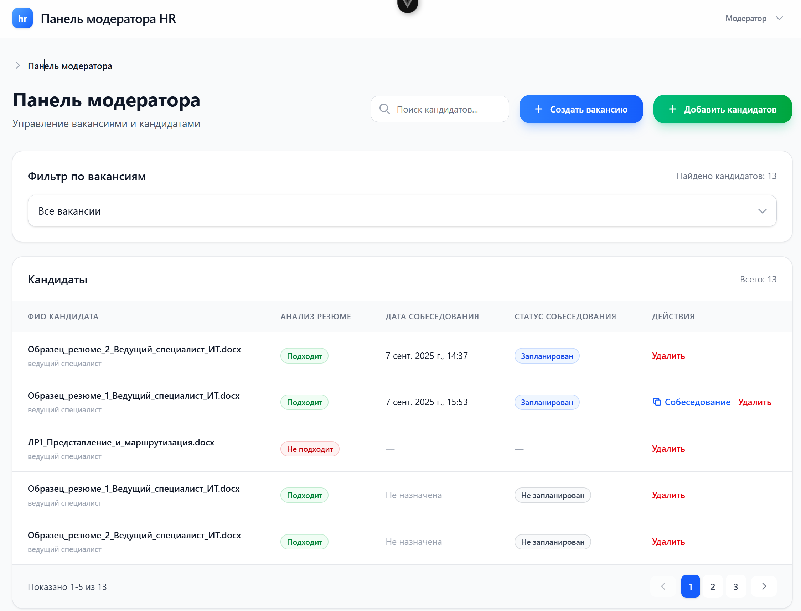
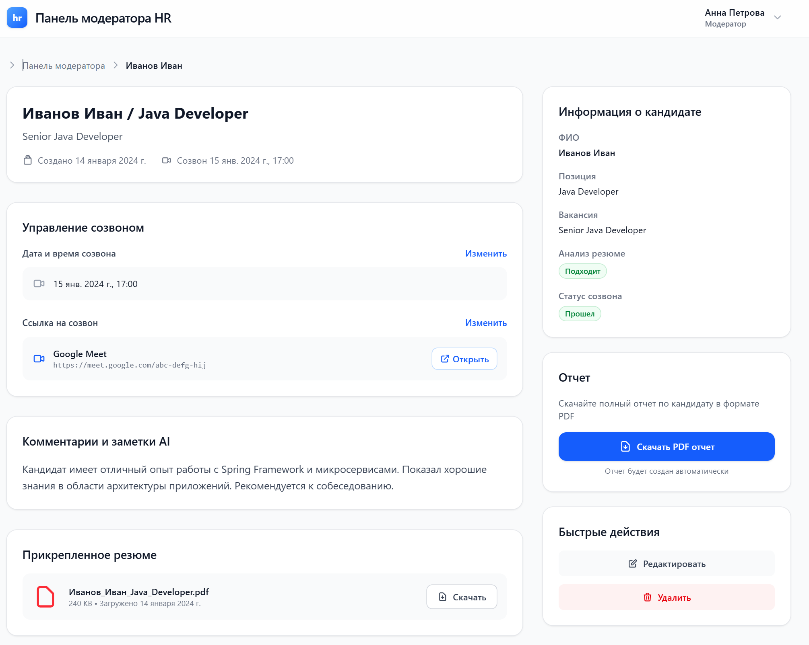

# vue-moderator-s-panel-hr

<p align="center">
  
  
</p>

## Что это

## Что это ?

**Модераторская панель** (frontend на Vue) для управления HR-контентом: модератор создаёт и редактирует вакансии, добавляет кандидатов, управляет статусами и комментариями.  
> Важно: **HR-часть у нас на бэке с ИИ** — здесь только интерфейс **модератора**. Все «умные» функции и финальные решения — на стороне бэкенда.

**Ссылка на бэкенд (пример):** `https://backend.example.com`  

---

## Быстрый старт (TL;DR)

```bash
# 1) Клонируйте репозиторий
git clone https://github.com/your-org/vue-moderator-s-panel-hr.git
cd vue-moderator-s-panel-hr

# 2) Установите зависимости
npm install   # 

# 3) Запустите dev-сервер
npm run dev

# 5) Откройте в браузере
# Обычно: http://localhost:5173/ (Vite)
```


